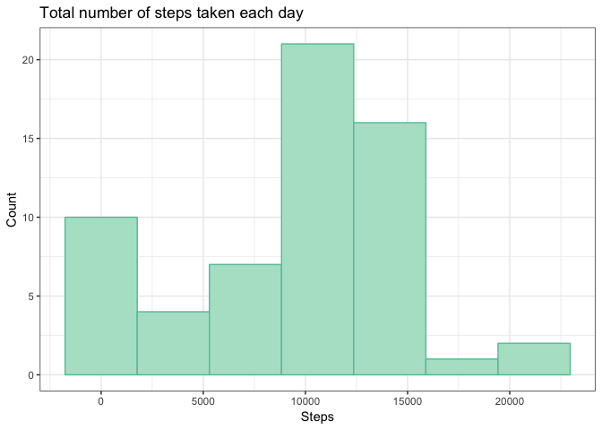
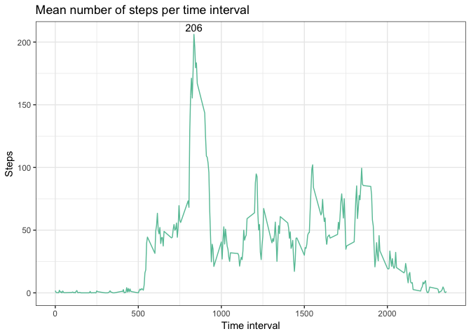
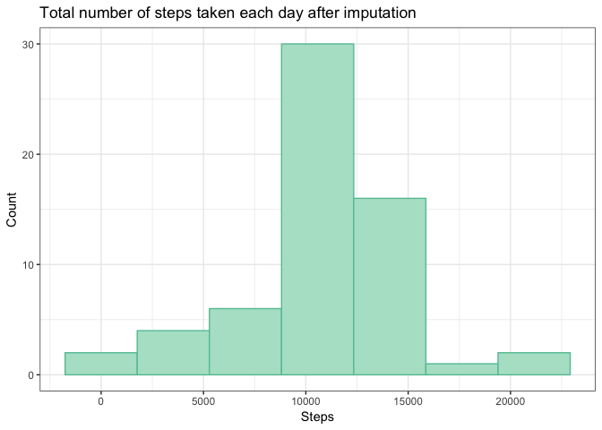
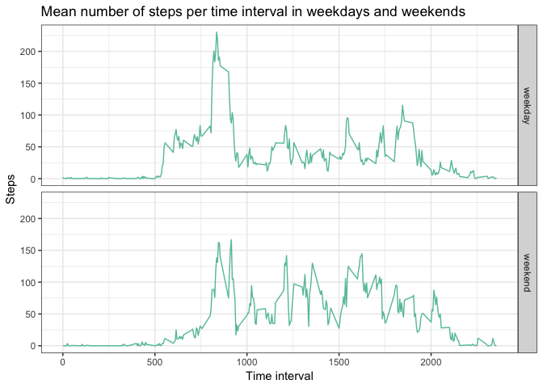

## Loading and preprocessing the data  

Let's first load some packages that will prove useful for this analysis.  


```r
library(tidyverse)
library(magrittr)
library(RColorBrewer)
library(naniar)
```

Now we'll unzip and load the data.  


```r
unzip("./activity.zip", exdir = "./")
```


```r
df <- read_csv("activity.csv")
```

```
## Parsed with column specification:
## cols(
##   steps = col_integer(),
##   date = col_date(format = ""),
##   interval = col_integer()
## )
```

```r
df
```

```
## # A tibble: 17,568 x 3
##    steps date       interval
##    <int> <date>        <int>
##  1    NA 2012-10-01        0
##  2    NA 2012-10-01        5
##  3    NA 2012-10-01       10
##  4    NA 2012-10-01       15
##  5    NA 2012-10-01       20
##  6    NA 2012-10-01       25
##  7    NA 2012-10-01       30
##  8    NA 2012-10-01       35
##  9    NA 2012-10-01       40
## 10    NA 2012-10-01       45
## # ... with 17,558 more rows
```

The dataset already seems to be in a good format (I used `readr::read_csv()` so the `date` column was automatically parsed as a datetime object).  

I will save a color palette that I will use during the analysis.  


```r
pal_set <- brewer.pal(8, "Set2")
pal_pastel <- brewer.pal(8, "Pastel2")
```


## What is the mean total number of steps taken per day?

Let's create a dataframe called `tot_steps_df` with the total number of steps per each day, ignoring `NA`s.  


```r
tot_steps_df <- df %>% 
    group_by(date) %>% 
    summarise(tot_steps = sum(steps, na.rm = T)) 
tot_steps_mean <- mean(tot_steps_df$tot_steps)
tot_steps_median <- median(tot_steps_df$tot_steps)
summary(tot_steps_df$tot_steps)
```

```
##    Min. 1st Qu.  Median    Mean 3rd Qu.    Max. 
##       0    6778   10395    9354   12811   21194
```

Now we can plot the histogram of the total number of steps per each day.  


```r
tot_steps_df %>% 
    ggplot(aes(x = tot_steps)) +
    geom_histogram(bins = 7, fill = pal_pastel[1], color = pal_set[1]) + 
    labs(x = "Steps", y = "Count", 
         title = "Total number of steps taken each day") + 
    theme_bw()
```

<!-- -->

**The mean number of steps taken each day is 9354, while the median is 10395.**  


## What is the average daily activity pattern?  

Let's first create a new dataframe called `avg_steps_df` with the average number of steps per each time interval.  


```r
avg_steps_df <- df %>% 
    group_by(interval) %>% 
    summarise(avg_steps = mean(steps, na.rm = T))
best_interval_idx <- which.max(avg_steps_df$avg_steps)
best_interval <- avg_steps_df[best_interval_idx, ]
avg_steps_df
```

```
## # A tibble: 288 x 2
##    interval avg_steps
##       <int>     <dbl>
##  1        0    1.72  
##  2        5    0.340 
##  3       10    0.132 
##  4       15    0.151 
##  5       20    0.0755
##  6       25    2.09  
##  7       30    0.528 
##  8       35    0.868 
##  9       40    0     
## 10       45    1.47  
## # ... with 278 more rows
```

Let's now plot these values.  


```r
avg_steps_df %>% 
    ggplot(aes(x = interval, y = avg_steps)) + 
    geom_line(color = pal_set[1]) + 
    geom_text(aes(label = if_else(avg_steps == max(avg_steps), 
                                  as.character(as.integer(avg_steps)), "")), 
              vjust = -0.4) + 
    labs(x = "Time interval", y = "Steps", 
         title = "Mean number of steps per time interval") + 
    theme_bw()
```

<!-- -->

**The time interval with the highest number of steps is 835 (corresponding to 8:35 in human time), with an average of 206 steps across all days.**  


## Imputing missing values

We can use the great `miss_var_summary()` function of the `naniar` package to find out how many missing values are present in the dataset.  


```r
miss_var_summary(df)
```

```
## # A tibble: 3 x 3
##   variable n_miss pct_miss
##   <chr>     <int>    <dbl>
## 1 steps      2304     13.1
## 2 date          0      0  
## 3 interval      0      0
```

The only feature with `NA`s is the `steps` variable.  

**The total number of rows with `NA`s in the data is 2304.**  

We will fill in these values using the mean number of steps in the given time interval, exploiting the `avg_steps_df` dataset created for the previous task.  
First, we'll merge the two datasets together; then we will pick the mean number of steps for observations where the value in the `steps` column is `NA`.  


```r
clean_df <- df %>% 
    inner_join(avg_steps_df, by = "interval")
clean_df$steps = as.double(clean_df$steps)
clean_df %<>% 
    mutate(steps = if_else(is.na(steps), 
                           avg_steps, steps))
clean_df %<>% 
    select(-avg_steps)
clean_df
```

```
## # A tibble: 17,568 x 3
##     steps date       interval
##     <dbl> <date>        <int>
##  1 1.72   2012-10-01        0
##  2 0.340  2012-10-01        5
##  3 0.132  2012-10-01       10
##  4 0.151  2012-10-01       15
##  5 0.0755 2012-10-01       20
##  6 2.09   2012-10-01       25
##  7 0.528  2012-10-01       30
##  8 0.868  2012-10-01       35
##  9 0      2012-10-01       40
## 10 1.47   2012-10-01       45
## # ... with 17,558 more rows
```

Now we can check if the histogram of the total number of per each day calculated using `clean_df` differs from what we saw in the first task.  


```r
clean_tot_df <- clean_df %>% 
    group_by(date) %>% 
    summarise(tot_steps = sum(steps)) 
clean_tot_df %>% 
    ggplot(aes(x = tot_steps)) +
    geom_histogram(bins = 7, fill = pal_pastel[1], color = pal_set[1]) + 
    labs(x = "Steps", y = "Count", 
         title = "Total number of steps taken each day after imputation") + 
    theme_bw()
```

<!-- -->

The histogram doesn't look much different than the previous one, but let's check the actual mean and median values.  


```r
tot_clean_mean <- mean(clean_tot_df$tot_steps)
tot_clean_median <- median(clean_tot_df$tot_steps)
summary(clean_tot_df$tot_steps)
```

```
##    Min. 1st Qu.  Median    Mean 3rd Qu.    Max. 
##      41    9819   10766   10766   12811   21194
```

**The mean number of steps taken each day after imputing missing values is now 10766, which is equal to the median (10766); these values are close to the median found in the original dataset (10395). This is expected, since we used average values to fill in the `NA`s.**  


## Are there differences in activity patterns between weekdays and weekends?

Let's first create the new variable `day_of_week` containing the levels `weekday` and `weekend`, indicating whether the corresponding date is a weekday or weekend day.  


```r
clean_df$day_of_week <- weekdays(clean_df$date)
clean_df %<>% 
    mutate(day_of_week = if_else(day_of_week == "Saturday" | day_of_week == "Sunday", 
                                 "weekend", "weekday"))
clean_df$day_of_week <- as.factor(clean_df$day_of_week)
clean_df
```

```
## # A tibble: 17,568 x 4
##     steps date       interval day_of_week
##     <dbl> <date>        <int> <fct>      
##  1 1.72   2012-10-01        0 weekday    
##  2 0.340  2012-10-01        5 weekday    
##  3 0.132  2012-10-01       10 weekday    
##  4 0.151  2012-10-01       15 weekday    
##  5 0.0755 2012-10-01       20 weekday    
##  6 2.09   2012-10-01       25 weekday    
##  7 0.528  2012-10-01       30 weekday    
##  8 0.868  2012-10-01       35 weekday    
##  9 0      2012-10-01       40 weekday    
## 10 1.47   2012-10-01       45 weekday    
## # ... with 17,558 more rows
```

Now we can use these data to check if there is any difference in the mean number of steps per interval between weekdays and weekends.  


```r
avg_clean_df <- clean_df %>% 
    group_by(interval, day_of_week) %>% 
    summarise(avg_steps = mean(steps))
avg_clean_df %>% 
    ggplot(aes(x = interval, y = avg_steps)) + 
    geom_line(color = pal_set[1]) + 
    facet_grid(day_of_week ~ .) + 
    labs(x = "Time interval", y = "Steps", 
         title = "Mean number of steps per time interval in weekdays and weekends") + 
    theme_bw()
```

<!-- -->

**It seems like, during weekends, the activity is evenly spread across the day, without the spike seen in weekday mornings, and the average number of steps seems higher.**  
I like to think that this may due to the fact that the subject did not go jogging before work during weekends, and spent weekends going around his city instead of sitting at his desk.  


